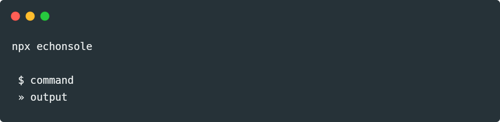

# Echo console (echonsole)

CLI simulator for broadcasting javascript commands


### Attach

```html
<script src="http://127.0.0.1:3030/echonsole.js"></script>
```

### Start

```
npx echonsole                                            

 $ command
 » output
```
